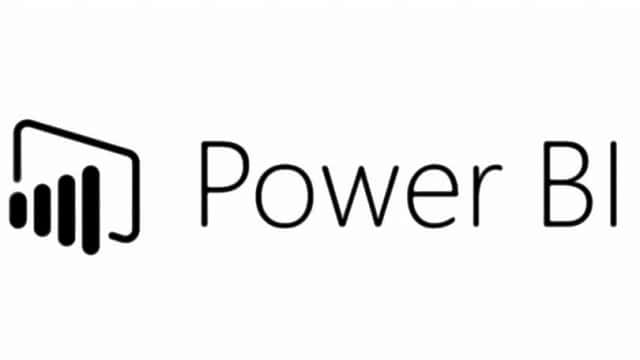
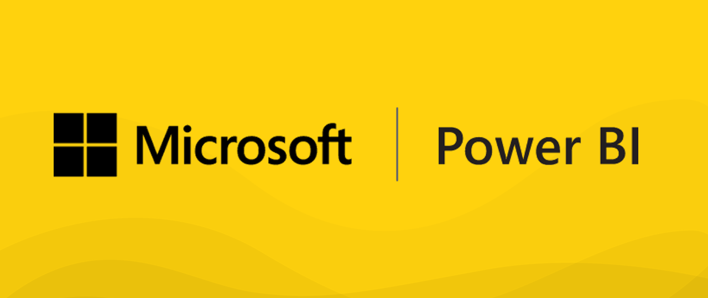
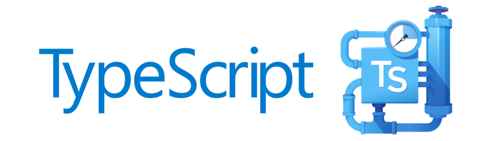
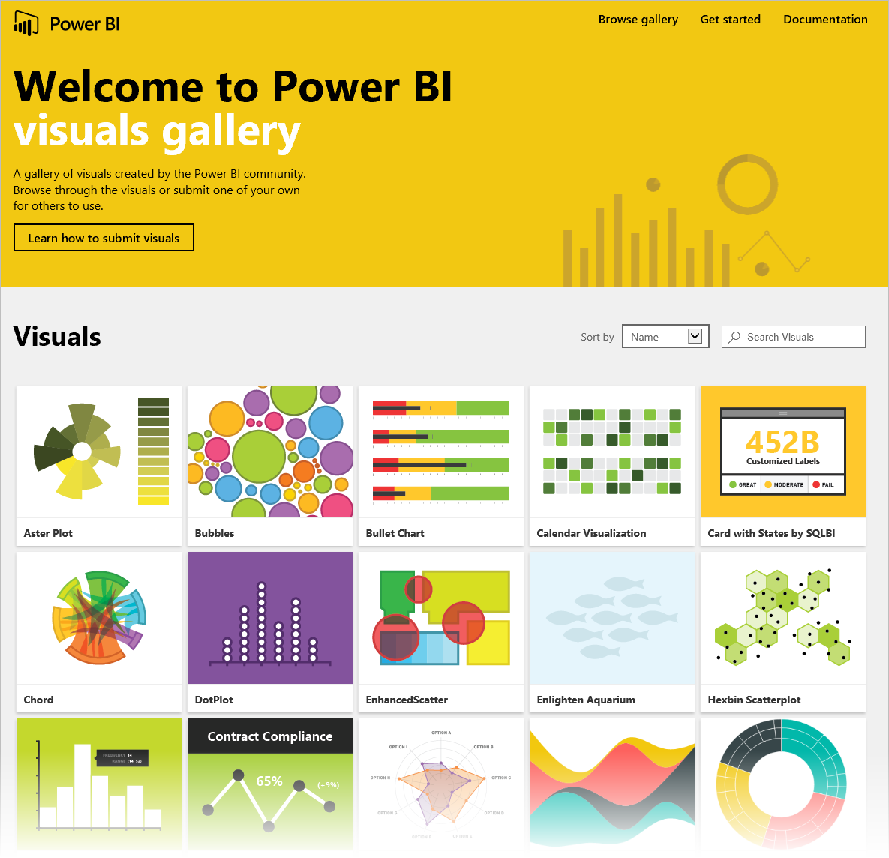

#   Custom Visual Development

##  Power BI

**Power BI** is a suite of business analytics tools that deliver insights  throughout your organization. Connect to hundreds of data sources,  simplify data prep, a nd drive ad hoc analysis. Produce beautiful  reports, then publish them for your organization to consume on the web  and across mobile devices. Everyone can create personalized dashboards  with a unique, 360-degree view of their business. And scale across the  enterprise, with governance and security built-in.

## Custom Visual

Our data can be of various type depicting various situations which longs for proper analysis and decision making from where when can eventually make out a conclusion. Despite the fact that **Power BI** has tones of visuals in its gallery yet the need of developing new visuals for greater needs never ends. **Power BI custom visual development** offers great freedom to the developers to give shape to new data analytic tools from scratch. It offers necessary tools for developing, debugginng, implementing and importing your creation into your report without flaws. It extends the possibility of traditional graphs on MS Excel to great user friendly interativity and co-ordination. With customizable almost anything ,**Power BI is a master piece.**

The custom visual that i have developed is shown below. The **purpose,reasons are to be kept secret** hence i can only show snapshots of it with **dummy data**.

## Requirements

Though **Power BI** custom visual is free to build and use yet there is one restriction; Microsoft won't provide any individual licences or trials in this field. In order to be a Power BI developer you must join any organisation that has Power BI licenses or at least should give you a work e-mail address. Using personal account you get a error message like the one below.

 

> However if you are connected to any organstion you can actually get yourself signed up and use Power BI for 60 days at most. Like I had made my access via my college emai id and mostly by the mail id offered by **MAQ Software** during my internship in order to use and develop on Power BI.

## Technology Stack

To be profound in developing **Custom Visuals in Power BI** these are the certain mandatory things that one must be proficient to make a meaningful visual out of raw data.

- Types enable JavaScript developers to  use highly-productive development tools and practices like static  checking and code refactoring when developing JavaScript applications.Types are optional, and type inference  allows a few type annotations to make a big difference to the static  verification of your code. Types let you define interfaces between  software components and gain insights into the behavior of existing  JavaScript libraries. **TypeScript** offers support for the latest and evolving JavaScript  features, including those from ECMAScript 2015 and future proposals,  like async functions and decorators, to help build robust components.                        

- **D3.js** is a JavaScript library for manipulating documents based on data. **D3** helps you bring data to life using HTML, SVG, and CSS. D3’s emphasis on web standards gives you the full capabilities of modern browsers  without tying yourself to a proprietary framework, combining powerful  visualization components and a data-driven approach to DOM manipulation. 

  

  

  

- **SVG** is an XML language, similar to XHTML, which can be used to draw vector graphics. It can be used to create an image either by specifying all  the lines and shapes necessary, by modifying already existing raster  images, or by a combination of both. The image and its components can  also be transformed, composited together, or filtered to change their  appearance completely.

- **Web Development** concepts, aspects and techniques. **HTML5**  is the latest version of  Hypertext Markup Language, the code that describes web pages. It's  actually three kinds of code: **HTML,** which provides the structure;  **Cascading Style Sheets (CSS3)**, which take care of presentation; and  **JavaScript**, which makes things happen. 

  **JQuery** is a cross-platform JavaScript library designed to simplify  the client-side scripting of HTML. It is free, open-source software  using the permissive MIT License.  

  **Bootstrap** is an open source toolkit for developing with HTML, CSS, and  JS. Quickly prototype your ideas or build your entire app with our Sass  variables and mixins, responsive grid system, extensive prebuilt  components, and powerful plugins built on jQuery. 

  

- **Power BI Desktop** lets you create a collection of queries, data  connections, and reports that can easily be shared with others. Power BI Desktop integrates proven Microsoft technologies – the powerful Query  engine, data modeling, and visualizations – and works seamlessly with  the online **Power BI service**. Moreover you can also get a lot of custom made visuals in the gallery as shown below.

## MAQ Software

**MAQ Software** delivers innovative software solutions for Fortune 500 companies.  Using the latest agile engineering techniques in a focused and  disciplined manner,  accelerates software initiatives that enable the  customers to transform their businesses. It serves customers in  industries including technology, retail, energy, and healthcare.

> **MAQ Software, Hyderabad** had been my place for summer internship after 3rd year for eight weeks. Developing **Custom Visual for Power BI** had been my  sole project. This is my 2nd project that i developed since i had finished my first project before the stipulated time. Since i have been instructed not to get detail into the insights of it for **SECURITY REASONS** so i will only depict an abstract of what i worked on. 

## Abstract and Journey

This is my second project on **Microsoft Power BI Custom Visual Development.** Since i had already completed he first project before stupulated time so i was allocated another one as well. The below image is a working snapshot of my second project.

## Some Useful Links

#### Microdoft Power BI : https://powerbi.microsoft.com/en-us/

#### MAQ Software : https://maqsoftware.com/

#### Microsoft Power BI github repo : https://github.com/Microsoft/PowerBI-visuals

------

